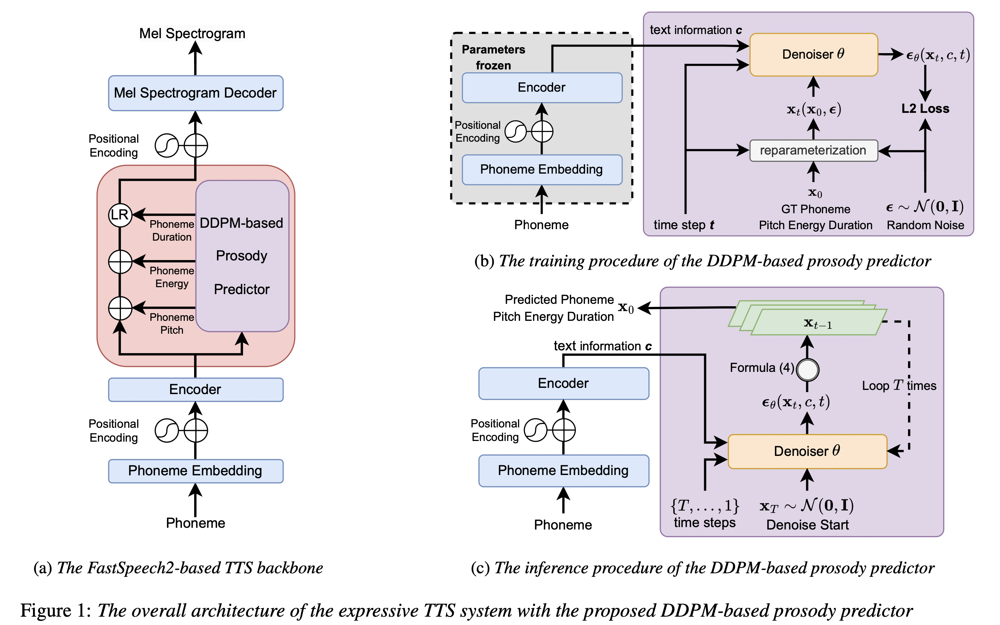

# DiffVar - PyTorch Implementation

This is a PyTorch implementation of Interspeech 2023 paper [**Diverse and Expressive Speech Prosody Prediction with Denoising Diffusion Probabilistic Model**](https://arxiv.org/abs/2305.16749). 



# Audio Samples
Audio samples generated by this implementation can be found [here](https://thuhcsi.github.io/interspeech2023-DiffVar/). 

# References
- [ming24's FastSpeech2 implementation](https://github.com/ming024/Fastspeech2)
- [Official DiffSpeech implementation](https://github.com/NATSpeech/NATSpeech)

# Citation
```
@misc{li2023diverse,
  title={Diverse and Expressive Speech Prosody Prediction with Denoising Diffusion Probabilistic Model}, 
  author={Xiang Li and Songxiang Liu and Max W. Y. Lam and Zhiyong Wu and Chao Weng and Helen Meng},
  year={2023},
  eprint={2305.16749},
  archivePrefix={arXiv},
  primaryClass={cs.SD}
}
```
